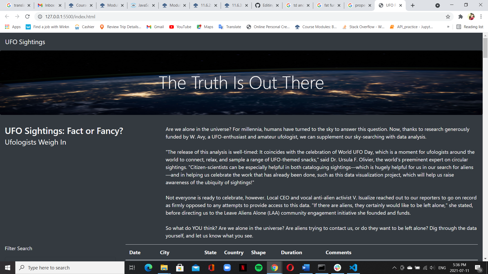
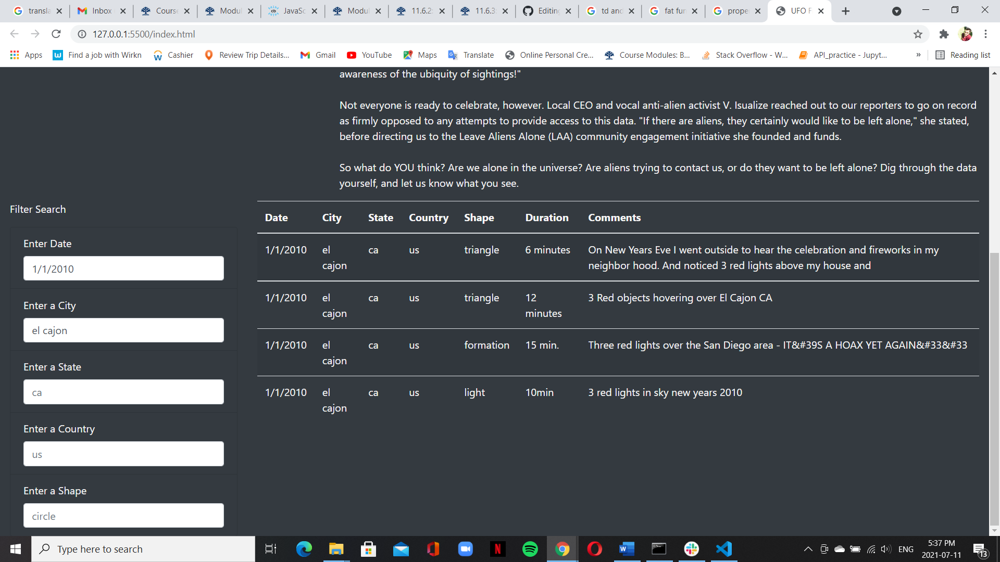
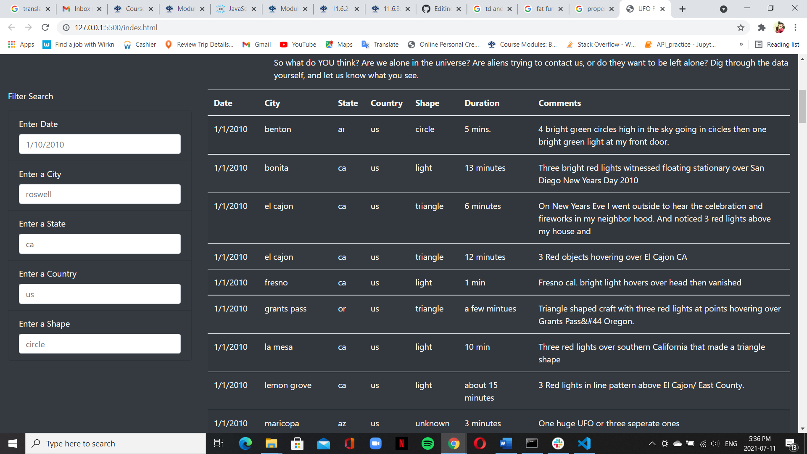

# UFOs

## Overview of the analysis:
This Analysis is about creating a dynamic webpage that can show the filtered UFO sightings table by user input  .the page allows you to pull information from a javascript data file using filters on the page such as city, state, country, and shape.  

 

## Results:
The webpage components are the navbar, title, Image, Paragraphs. Headings and filter search contain multiple criteria such as the event date, city, state, country, and shape. 
The HTML page will show the sightings based on users' input the table will automatically filter the results accordingly. Multiple filters can be entered at the same time
display table relevant to data

## Summary:
The drawback of this webpage  the image is huge for phone users and when you open the webpage  on the phone it zooms out and resizing is a major problem that can be fixed by formatting the readjust 
Another drawback the input of the filter is difficult to delete  if there were a button for deleting will make the webpage easier to use  
An additional drawback of creating so many filters  it  makes searching more complex  if it has only two up to three filters will be better to use 
additional recommendations for further development
The first one will be reducing the number of filters to make it easier to use
Resizing the table to make it  more visible  so you can check the data before searching 
Adding delete (button) to the filters 

